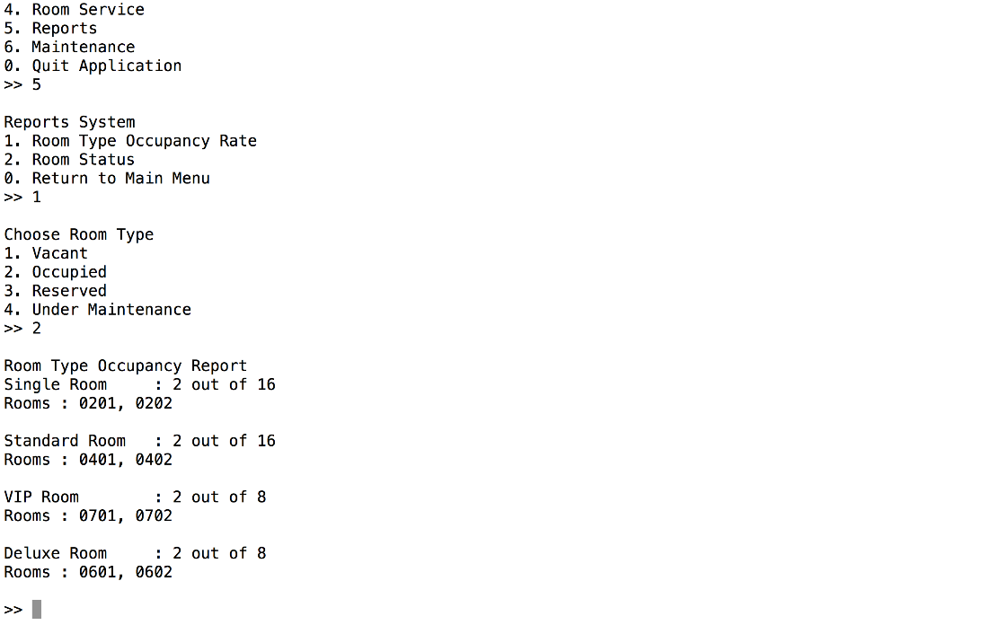
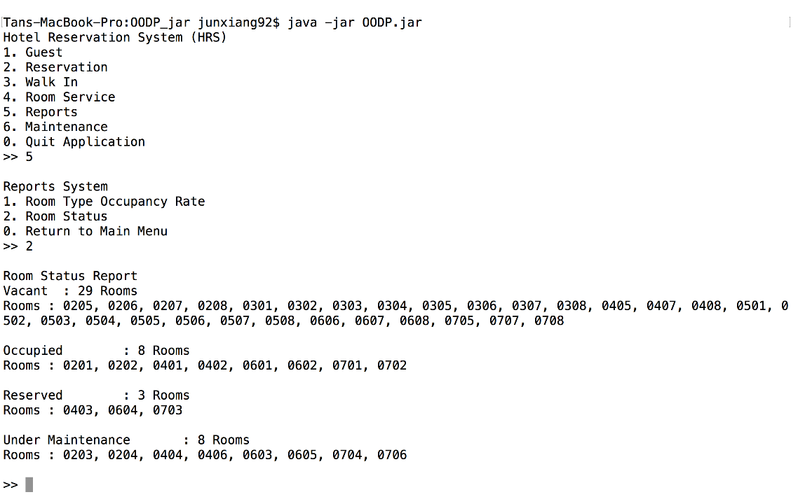
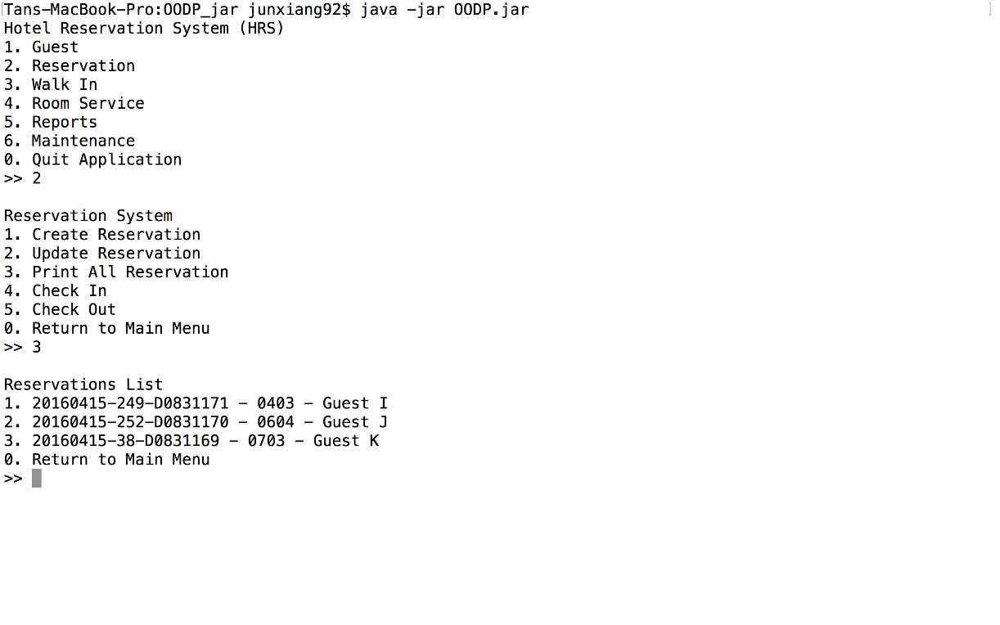
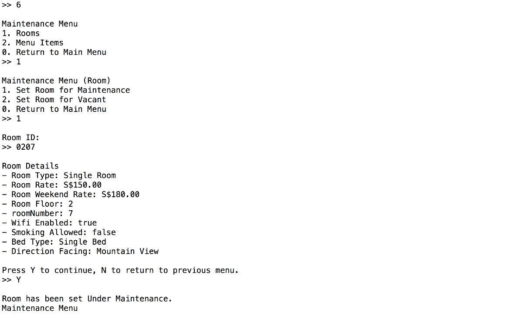
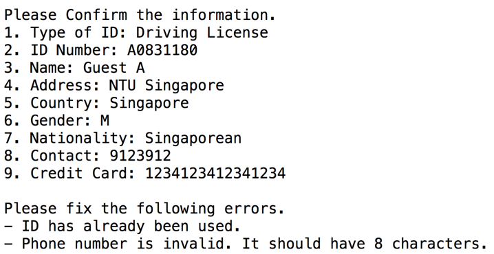
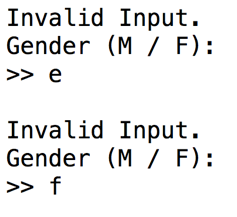
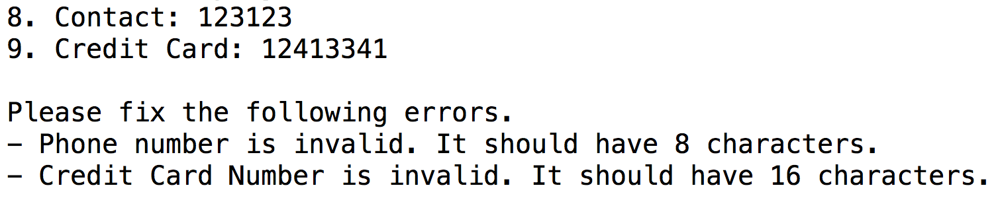
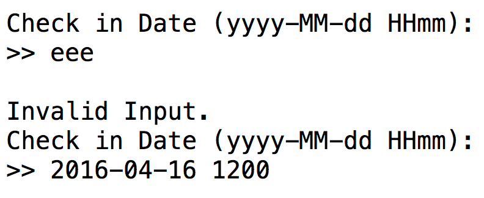
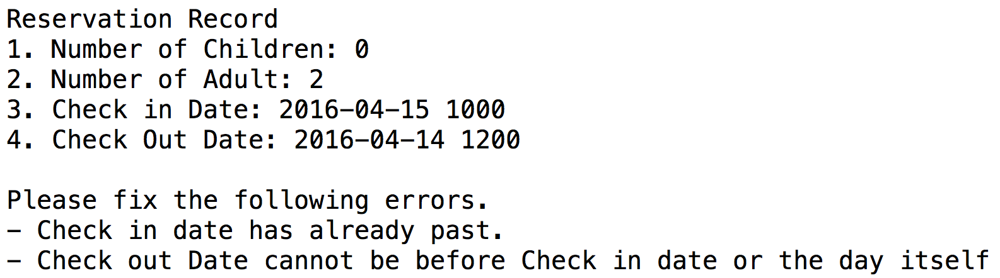

# Hotel Reservation and Payment System (HRPS)

## Design considerations

**Approach Taken**

In this project, we have taken an Object oriented approach where Data Encapsulation is implemented in our coding. Data encapsulation implies that each class has its own set of data to be protected and would not be visible to others. The objects will communicate between themselves via the passing of message. Our group’s approach to the system implementation is by first, discussing the program architecture from the given functional requirements, secondly, derives the classes needed to be establish from the specifications provided, and lastly, implement the codes to create the Hotel Reservation and Payment System.

**Principles Used** 

Single Responsibility Principle is used in the project’s process. The principle ensures that each class has its own task and responsibilities to carry out and they do not overlap. This loose coupling concept allows easy debugging of issues and possible reusability characteristic. 

Interface Segregation Principle was observed during the implementation of codes to allow a smooth interaction between the user and the system. The separation of user interface into smaller, specific ones, allow the users to access the methods and options that are of interest to them. This keeps the system decoupled and allow changes to be made easily.

**Assumptions made in this program:**
- The system interacts with the Staff of the Hotel
- Payment is always successful
- Currency is in Singapore Dollar
- The hotel has 48 rooms
- There are 4 room types: Single, Standard, VIP, Deluxe
- Room types are separated according to hotel’s levels
- The guests have knowledge of what items are in the menu
- Guest checks in at 12 noon 
- Credit card details have to be taken down regardless of the mode of payment

## Detailed UML Class Diagram

The figure belows shows the class diagram of our HRPS. In the following diagram, Controls and Boundaries are left out due to space constraints.

**Classes** 
- All Entities belong to the superclass Entity that works with the FileManager Class
 - Entity Class manages the searching and relations between classes 
- OrderMenuItem is a composition to RoomService
 - The reason is OrderMenuItem belongs to RoomService Object 
- OrderMenuItem is a aggregation to RoomService
 - The reason is MenuItem may be updated after a Guest has made a RoomService 
- Report & Payment are independent Classes 
 - The reason is there are no requirements to save into a file
 
**Controls**
- Handles the flow the information between the Boundary and Entity 
- Implements an Control class

**Boundaries**
- All Boundaries belong to the superclass Boundary that manages the input / output through this single class. 
- User Validation methods that binds the user to specific inputs.

## Detailed UML Sequence Diagram

The figure below shows the sequence diagram that emulates a Guest checking out of the Hotel Reservation System and printing the Bill Invoice to the Guest.

Some Key Areas:
> When checking out, the Hotel staff has the ability to check out via Guest ID, Guest Name and Room ID. This provides the flexibility to the guest where there are other means of verification for checking out.

## Design Considerations

Throughout the whole application, the design considerations on Entity, Control and Boundary with the SOLID principle was applied.

### SOLID Principles Examples

**Single Responsibility Principle**

`Guest` does not manage check in and check out.

**Open / Closed Principle**

Having a superclass `Entity` & `Boundary` and an interface `Control` helps by implementing strict rules in functions declarations to help classes relate to each other closely for extension.

**Liskov Substitution Principle**

Using generic types in `Entity` class, objects are upcasted and downcasted back to its own class without altering any function.

**Interface Segregation Principle**

The segregation between Boundaries, Controls and Entities.

**Dependency Inversion Principle**

Entities and Boundaries are dependant on an abstract class `Entity` and `Boundary` respectively.

### New features

**Luggage storage service**

One feature that we could add in as further enhancement is to implement a luggage storage service for the guests. This service would allow the guests to deposit their luggage at the hotel if they have other plans before checking in.

-	Reservation(only) Guests can deposit their luggage at the hotel up to 3 days before check in
-	Luggage tagged with an ID number
-	Optional detail of luggage ID added into guest details
-	System design can incorporate this feature in via extensibility of the existing Guest class.

**Taxi- Pick Up service for guests**

Another new feature that could be implement, is to allow guests to call for a taxi. The service is only available to guests after check in and before check out. This service will help guests who wishes to arrive at their destination without delays and troubles.

-	Guests can request for taxi service during their stay in the hotel
-	Taxi license plate would be recorded into the system after confirmation from the driver and the guest
-	Taxi bill can either be paid to drivers or added to guest’s hotel bill
-	This feature can be added into the system by the reusability principle where the feature’s concept is similar to the Room Service function.

## Test Cases

| Test | Case |
|------------ | -------------|
|Print Room type occupancy Rate | Hotel has 2 Single rooms, 2 Standard rooms, 2 VIP rooms, and 2 Deluxe rooms currently being occupied|
|||

| Test | Case |
|------------ | -------------|
|Print Room status | Hotel has 2 Single rooms, 2 Standard rooms, 2 VIP rooms, and 2 Deluxe rooms currently under maintenance|
|||

| Test | Case |
|------------ | -------------|
|Print Reservation List | Hotel has existing 3 Reservations made|
|||

| Test | Case |
|------------ | -------------|
|Room status needs to be updated | A Standard room has air conditioning problem|
|||

## Error Checking

1.	ID Validator
Ensures that each record in the entity has a unique ID.

2.	Boolean Validator
Ensures that boolean values are mapped to either or and not any random values.

3.	String Validator
Checks a particular string to be of a specific length. In this scenario, phone numbers and credit card not just have to be numbers but have 8 and 16 numbers respectively.

4.	Date Validator
Checks that date inputs by user match the date format. In this scenario, a dateFormat variable in Reservation Class is follow to only accept user inputs according to the template defined.

5.	Date already Past
Checks if dates though match the date format are either expired or does not make sense. In the following scenario, it is creating a reservation but check in date has already past and check out date is way before check in date itself.

# Declaration of Original Work for CE/CZ 2002 Assignment

We hereby declare that the attached group assignment has been researched, undertaken, completed and submitted as a collective effort by the group members listed below.

We have honoured the principles of academic integrity and have upheld Student Code of Academic Conduct in the completion of this work.

We understand that if plagiarism is found in the assignment, then lower marks or no marks will be awarded for the assessed work. In addition, disciplinary actions may be taken.

**TEAM**
- [Tan Jun Xiang](https://github.com/tjunxiang92)
-	Lee Vic Son
- 	[Arga Roh Sahrijal Saragih](https://github.com/d0ct0r4r6a)
- 	Luk Pui Ying
- 	Aubrey Quek 
